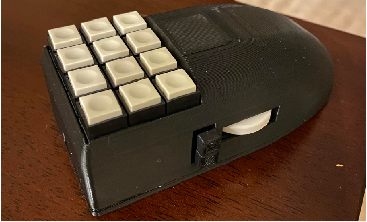
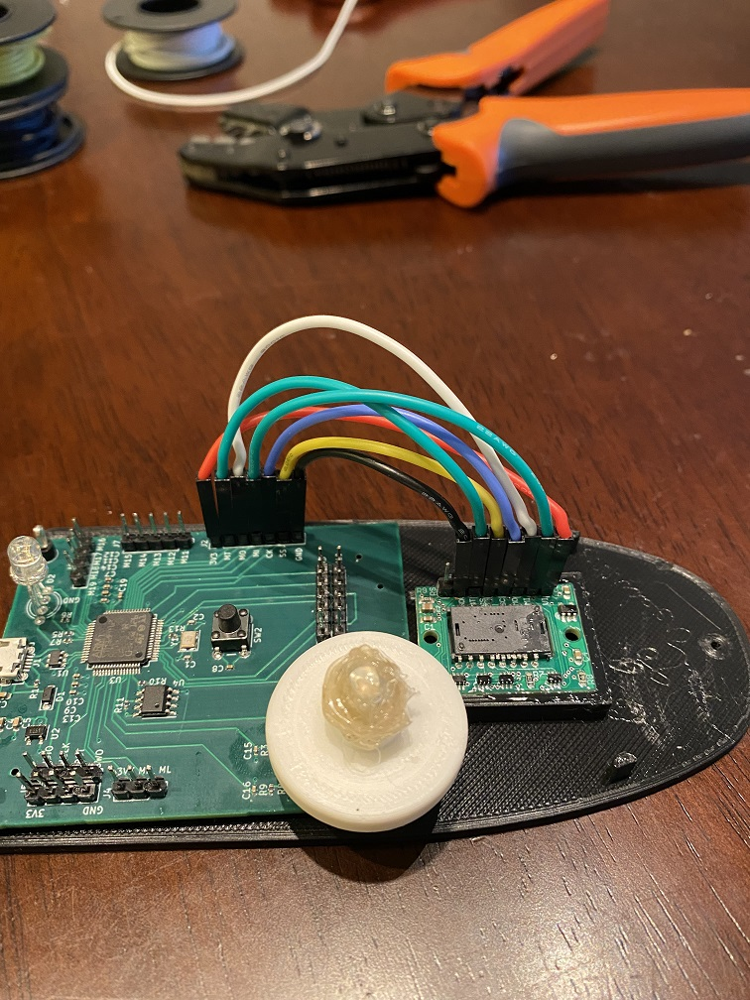
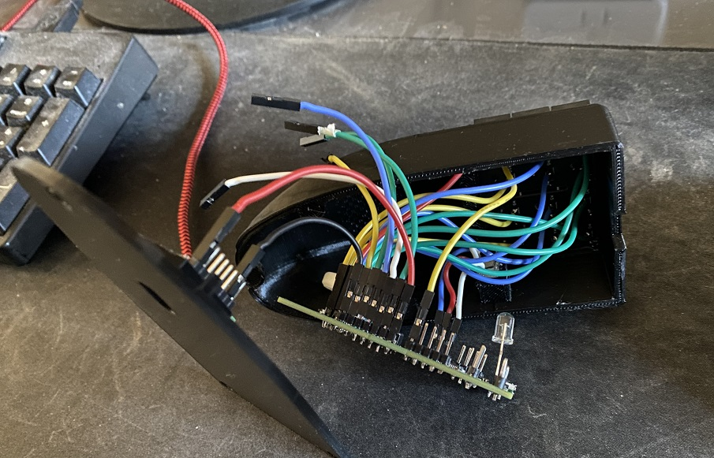

# Custom Gaming Mouse Project

One of my earlier embedded systems projects. A custom gaming mouse with up to 22 programmable buttons. The firmware is a bit rough around the edges, but I learned a lot about wired USB in the process of coding it.
I wrote a short Python script that communicates new settings to a USB endpoint dedicated to this purpose. 

This iteration implements 14 buttons, a mouse wheel, programmable DPI from 100 to 10000, a tricolored LED with 4 flashing modes, and button keybinds saved in an eeprom.

PCB is my own design featuring an STM32F4 microcontroller which I flashed using a J-Link SEGGER. The PMW3360 motion sensor was purchased as a COTs module. I would have liked to include this on the main PCBA, but the manufacturer was unrespsonsive to my emails and they don't stock the part openly at online retailers like digikey and mouser. The complete BOM and schematics are part of this repository

The 3D printed housing (also my design) was glued to the base plate with E6000. Not a particularly robust mechanical design, but it worked for me. The main issue with this is that, because I didn't write a custom bootloader, the device can no longer be programmed again. This isn't a huge issue, but the mouse wheel you see in the photo is actually "backwards" (Scrolling forward will scroll down, and scrolling backward will scroll up). This is an easy firmware fix, but I can no longer access the JTAG pins or BOOT switch. 

The LED can't really be seen in normal operation, though it can serve as a visual cue that new settings were successfully programmed when changing the keybinds using the python script.
[LED](images/mouse_photo04.jpg)
